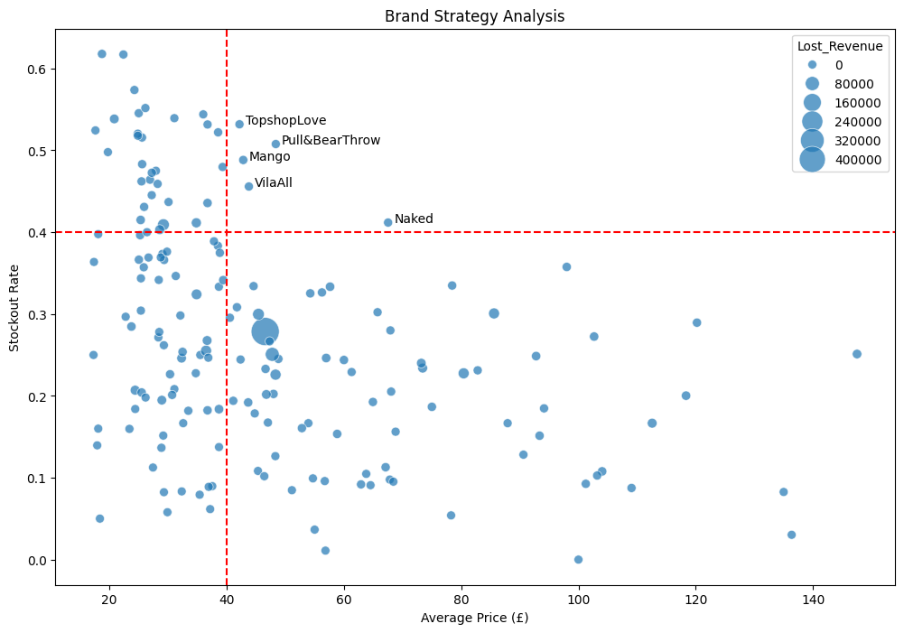

# ASOS Stockout Revenue Analysis

A data analysis project exploring ASOS product data to identify stockout patterns and estimate potential revenue loss.

---

## Problem

Stockouts (out-of-stock sizes) can lead to missed sales opportunities.

This project investigates:
- Where stockouts are most frequent  
- Which products and brands are losing revenue  
- How inventory decisions can be improved  

---

## Approach

- Cleaned data using pandas  
- Extracted brand names from product descriptions  
- Calculated stockout rate per product  
- Estimated lost revenue  
- Aggregated insights at brand level  

---

## Key Insight

High-priced products with high stockout rates represent the **biggest revenue opportunity** — strong demand but insufficient inventory.

---

## Visualization



---

## Tech Stack

- Python  
- pandas, numpy  
- matplotlib, seaborn  
- Jupyter Notebook  

---

## How to Run

```bash
pip install -r requirements.txt
jupyter notebook


## Author
Sushrut Narayan Singh
https://github.com/sushrutnarayan